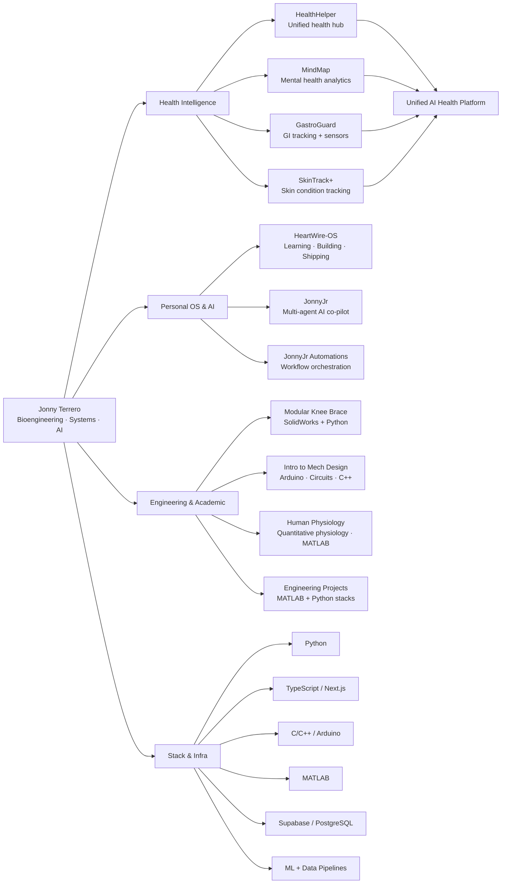

<div align="center">

# Jonny Terrero

**Biomedical Engineering · Full-Stack Systems · AI**

Building connected health intelligence systems — from biosensors to production platforms.

[](https://linkedin.com/in/jonnyterrero)
[](https://github.com/jonnyterrero)
[](https://jonnyterrero.github.io)

</div>

---

## About

Biomedical Engineering student (Chemistry + Math minors) building a multi-year engineering ecosystem that bridges **biomedical systems, full-stack software, embedded hardware, and AI**. Every project is built to production standards — clean architecture, real data pipelines, observable behavior, and deployable infrastructure from day one.

---

## Ecosystem Architecture



---

## Featured Projects

### Health Intelligence Platform

| Project | Stack | Description |
|---------|-------|-------------|
| [**HealthHelper**](https://github.com/jonnyterrero/HealthHelper) | Next.js · Supabase · TypeScript | Unified health intelligence hub — the platform layer connecting all health apps into a single dashboard |
| [**MindMap**](https://github.com/jonnyterrero/MindMap) | Python · Supabase · Next.js | Mental health tracking for anxiety, ADHD, bipolar, depression, and chronic migraines. RLS-secured data with longitudinal mood analytics |
| [**GastroGuard**](https://github.com/jonnyterrero/gastro-guard) | Python · Arduino · Supabase | GI health tracker with hardware sensor integration, layered analytics pipeline, and ML-ready feature engineering |
| [**SkinTrack+**](https://github.com/jonnyterrero/SkinTrack-) | Python · Computer Vision | Skin condition progression tracking through image capture and analysis for chronic skin conditions |

### Personal OS & AI

| Project | Stack | Description |
|---------|-------|-------------|
| [**HeartWire-OS**](https://github.com/jonnyterrero/HeartWire-OS) | Next.js · Supabase · Vercel | Personal workspace organizing coursework, engineering projects, AI agents, and research into one coherent system |
| [**JonnyJr**](https://github.com/jonnyterrero/JonnyJr) | OpenAI Agents SDK · JavaScript | Multi-agent AI co-pilot (Orchestrator → Planner → Coder → Researcher) with GitHub, Supabase, Notion, and Claude integrations |
| [**JonnyJr Automations**](https://github.com/jonnyterrero/JonnyJr-s-workflow-and-automations) | TypeScript | Workflow automations and agent orchestration layer powering JonnyJr's integrations |

### Engineering & Academic

| Project | Stack | Description |
|---------|-------|-------------|
| [**Modular Knee Brace**](https://github.com/jonnyterrero/Modular-Knee-Brace) | SolidWorks · Python | Modular knee brace prototype — full CAD model with embedded battery design and Python scripting |
| [**Intro to Mech Design**](https://github.com/jonnyterrero/Intro-to-Mech-Design) | C++ · Arduino | Upper-level bioengineering coursework: Arduino programming, circuit analysis, and computer architecture labs |
| [**Human Physiology for Engineers**](https://github.com/jonnyterrero/Human-Physiology-for-Engineers) | MATLAB | Full quantitative physiology course — labs, projects, test reviews, and lecture materials |
| [**Engineering Projects**](https://github.com/jonnyterrero/Engineering-Projects) | Python · MATLAB | Two engineering tech stacks (comprehensive + optimized) for biomedical/mechanical engineering applications |

### Practice & Portfolio

| Project | Stack | Description |
|---------|-------|-------------|
| [**Neetcode Problems**](https://github.com/jonnyterrero/Neetcode-Problems) | Python | NeetCode.io problem submissions — DSA practice and pattern recognition |
| [**Portfolio**](https://github.com/jonnyterrero/JonnyTerrero.github.io) | TypeScript | Live portfolio site |

---

## Engineering Stack

```
Languages        Python · TypeScript · JavaScript · C/C++ · MATLAB · SQL
Frameworks       Next.js 14 · React Native · Supabase · Prisma · Vercel
AI & Data        OpenAI Agents SDK · Claude API · NumPy · SciPy · SymPy · Matplotlib
Infrastructure   Docker · Proxmox · WireGuard · GitHub Actions · Make.com
Hardware         Arduino · Servo Systems · HC-SR04 · Sensor Integration · SolidWorks
```

---

## Live Metrics

<p align="center">
  
  
</p>

<p align="center">
  
</p>

<p align="center">
  
</p>

---

<div align="center">

*Structured like a system. Built like infrastructure. Maintained like a product.*

</div>
