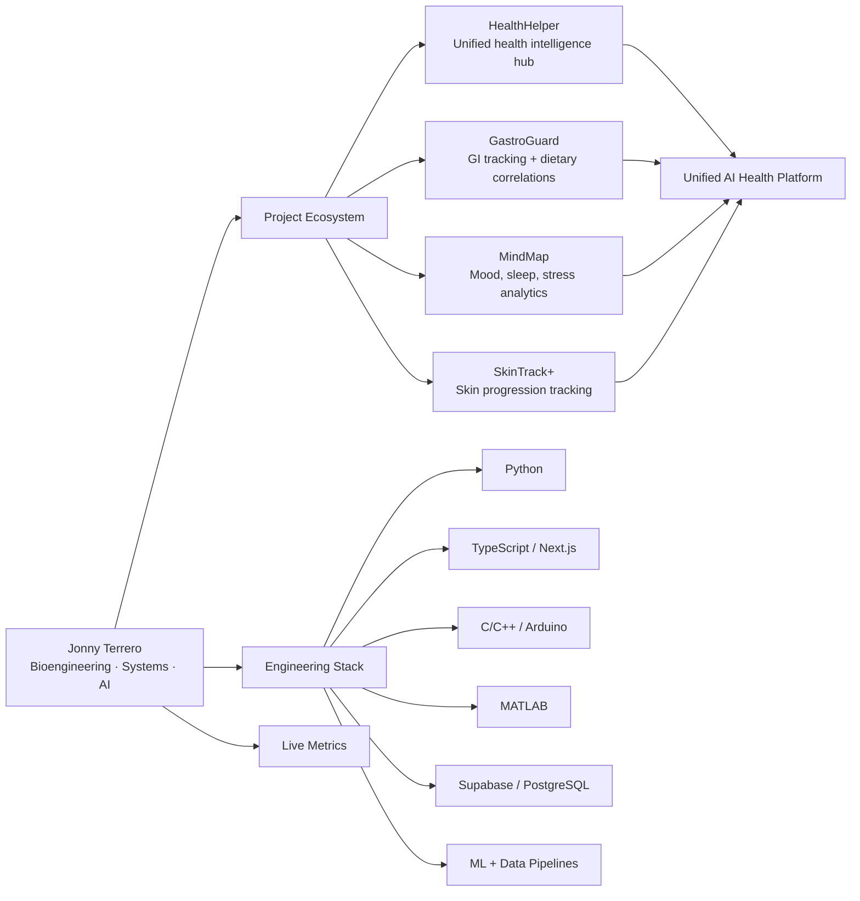

<div align="center">

# Jonny Terrero

**Biomedical Engineering · Systems Builder · AI**

Building connected health intelligence systems — from sensors to full-stack platforms.

[](https://linkedin.com/in/jonnyterrero)
[](https://github.com/jonnyterrero)

</div>

---

## System Identity

I'm a Biomedical Engineering student (Chemistry + Math minors) who treats every project like production infrastructure. My work sits at the intersection of **biomedical systems, full-stack software, embedded hardware, and AI** — with a long-term focus on building a unified health intelligence platform.

I don't build demos. I build deployable systems with clean architecture, real data pipelines, and observable behavior.

---

## Ecosystem Architecture



Every project feeds into a single vision: a modular, AI-driven health ecosystem where tracking, analytics, and recommendations converge.

---

## Featured Systems

| Project | Stack | Description |
|---------|-------|-------------|
| **HealthHelper** | Next.js · Supabase · AI | Unified health intelligence hub — the platform layer connecting all health apps |
| **GastroGuard** | Python · Arduino · Supabase · PostgreSQL | Gut health tracker with hardware sensors, layered analytics pipeline, and ML-ready feature engineering |
| **MindMap** | Next.js · Supabase · Prisma | Mood, sleep, and stress analytics with RLS-secured data and longitudinal insights |
| **SkinTrack+** | React Native · Computer Vision | Skin condition progression tracking through image capture and analysis |
| **5amClub** | Next.js 14 · Supabase · Vercel | Knowledge + productivity OS integrated with Notion and GitHub |
| **Soundly** | React Native · Next.js | Music discovery and social listening platform |
| **JonnyJr** | OpenAI Agents SDK · Python · Docker | Multi-agent AI co-pilot (Orchestrator → Planner → Coder → Researcher) with GitHub, Supabase, Notion, and Claude integrations |
| **Robotic Arm** | Arduino · C++ · HC-SR04 | 4-axis FSM-based autonomous pick-and-place system with ultrasonic sensing |

---

## Engineering Stack

**Languages**
`Python` · `TypeScript` · `JavaScript` · `C/C++` · `MATLAB` · `SQL`

**Frameworks & Platforms**
`Next.js 14` · `React Native` · `Supabase` · `Prisma` · `Vercel`

**AI & Data**
`OpenAI Agents SDK` · `Claude API` · `Perplexity Sonar` · `NumPy` · `SciPy` · `SymPy` · `Matplotlib`

**Infrastructure**
`Docker` · `Proxmox` · `WireGuard` · `GitHub Actions` · `Make.com`

**Hardware**
`Arduino` · `Servo Systems` · `HC-SR04 Ultrasonic` · `Sensor Integration` · `KiCad (upcoming)`

---

## Live Metrics

<p align="center">
  
  
</p>

<p align="center">
  
</p>

<p align="center">
  
</p>

---

## Profile Repo Structure

```text
jonnyterrero/
├── README.md
├── assets/
│   ├── banner/
│   ├── diagrams/
│   │   ├── ecosystem-architecture.svg
│   │   └── repo-map.svg
│   ├── projects/
│   └── icons/
├── .github/
│   └── workflows/
│       ├── update-readme.yml
│       ├── metrics.yml
│       └── recent-activity.yml
├── data/
│   ├── featured-projects.json
│   ├── links.json
│   └── metadata.json
├── scripts/
│   ├── update_recent_activity.py
│   ├── update_commits.py
│   └── build_readme_sections.py
└── docs/
    ├── profile-style-guide.md
    ├── architecture-notes.md
    └── badge-reference.md
```

---

<div align="center">

*Structured like a system. Built like infrastructure. Maintained like a product.*

</div>
