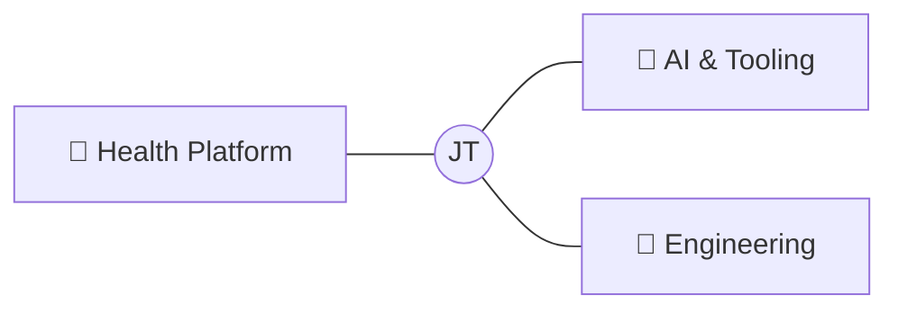

<div align="center">

# Jonny Terrero

**Biomedical Engineering · Full-Stack Systems · AI**

I build health platforms that work — from the sensor to the screen.

[](https://linkedin.com/in/jonnyterrero)
[](https://jonnyterrero.github.io)
[](https://leetcode.com/jterrero16)

</div>

---

Biomedical Engineering student (Chemistry + Math minors) working across the full stack — embedded hardware, production web apps, data pipelines, and AI agents. I don't build demos. If it ships, it ships right.



---

### 🧬 Health Platform

Building a modular ecosystem where tracking, analytics, and recommendations converge.

| Project | Stack | What it does |
|---------|-------|--------------|
| [**HealthHelper**](https://github.com/jonnyterrero/HealthHelper) | Next.js · Supabase · TS | Unified hub connecting all health apps into one dashboard |
| [**MindMap**](https://github.com/jonnyterrero/MindMap) | Python · Supabase · Next.js | Mental health tracking — mood, anxiety, ADHD, migraines, longitudinal analytics |
| [**GastroGuard**](https://github.com/jonnyterrero/gastro-guard) | Python · Arduino · Supabase | GI tracker with sensor integration and ML-ready feature pipeline |
| [**SkinTrack+**](https://github.com/jonnyterrero/SkinTrack-) | Python · CV | Skin condition progression tracking via image capture and analysis |

### 🤖 AI & Tooling

| Project | Stack | What it does |
|---------|-------|--------------|
| [**HeartWire-OS**](https://github.com/jonnyterrero/HeartWire-OS) | Next.js · Supabase · Vercel | Personal OS — coursework, projects, research, and agents in one workspace |
| [**JonnyJr**](https://github.com/jonnyterrero/JonnyJr) | OpenAI Agents SDK · JS | Multi-agent AI co-pilot with GitHub, Supabase, Notion, and Claude integrations |
| [**JonnyJr Automations**](https://github.com/jonnyterrero/JonnyJr-s-workflow-and-automations) | TypeScript | Workflow orchestration layer powering JonnyJr |

### 🔧 Engineering

| Project | Stack | What it does |
|---------|-------|--------------|
| [**Modular Knee Brace**](https://github.com/jonnyterrero/Modular-Knee-Brace) | SolidWorks · Python | Full CAD prototype with embedded battery design |
| [**Mech Design Labs**](https://github.com/jonnyterrero/Intro-to-Mech-Design) | C++ · Arduino | Arduino programming, circuit analysis, and computer architecture |
| [**Physiology Labs**](https://github.com/jonnyterrero/Human-Physiology-for-Engineers) | MATLAB | Quantitative physiology — labs, projects, and computational models |
| [**Engineering Projects**](https://github.com/jonnyterrero/Engineering-Projects) | Python · MATLAB | Biomedical/mechanical engineering application stacks |
| [**Neetcode**](https://github.com/jonnyterrero/Neetcode-Problems) | Python | DSA practice — patterns and problem solving |

---

### Stack

```
Languages        Python · TypeScript · C/C++ · MATLAB · SQL
Frameworks       Next.js · React Native · Supabase · Prisma · Vercel
AI & Data        OpenAI Agents SDK · Claude API · NumPy · SciPy · Matplotlib
Hardware         Arduino · Servo Systems · Ultrasonic Sensors · SolidWorks
Infra            Docker · Proxmox · WireGuard · GitHub Actions · Make.com
```

---

### 📊 Metrics

<p align="center">
  
  
</p>

<p align="center">
  
</p>

<p align="center">
  
</p>

---

<div align="center">

*Ships clean. Breaks nothing. Learns everything.*

</div>
